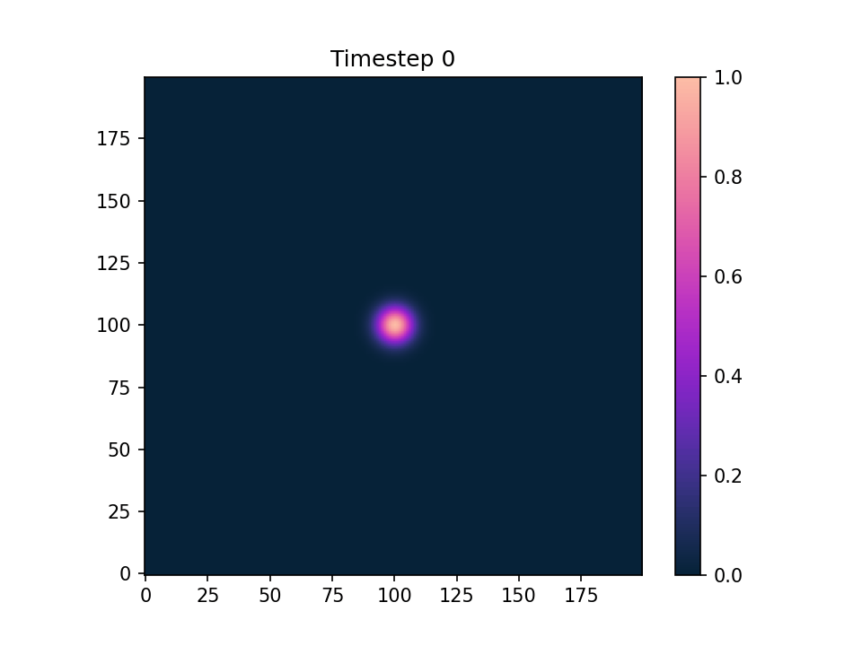
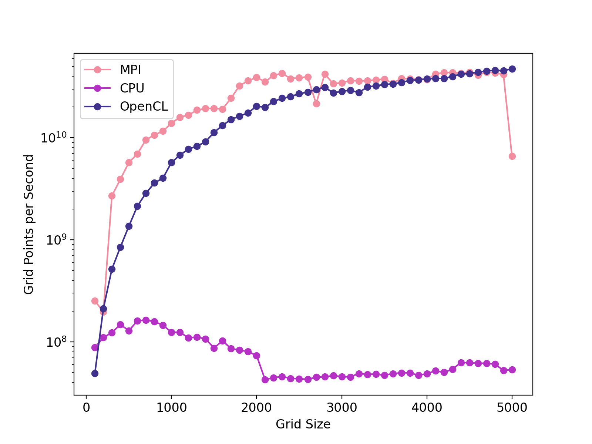
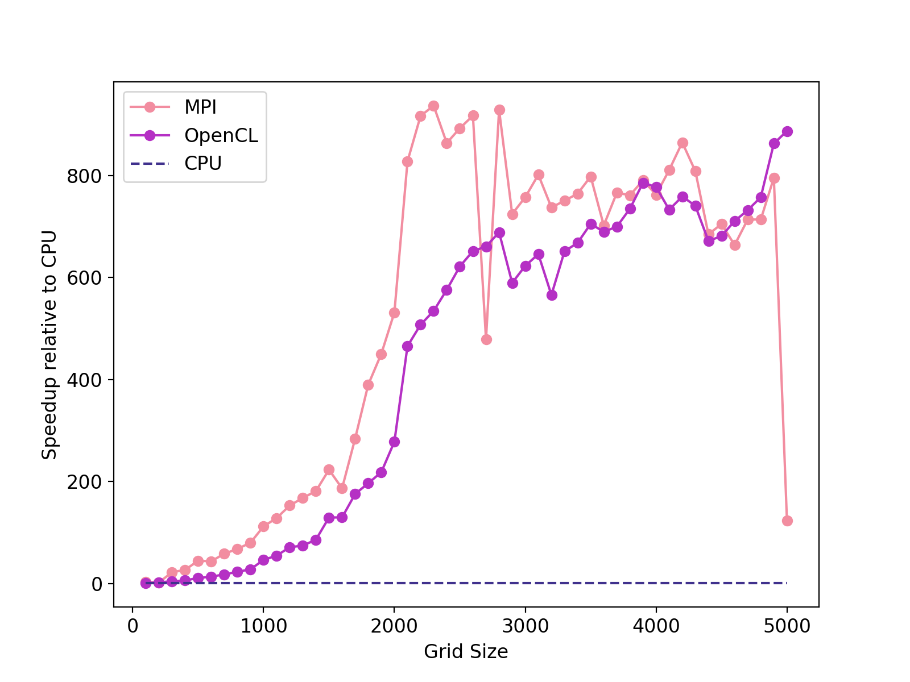
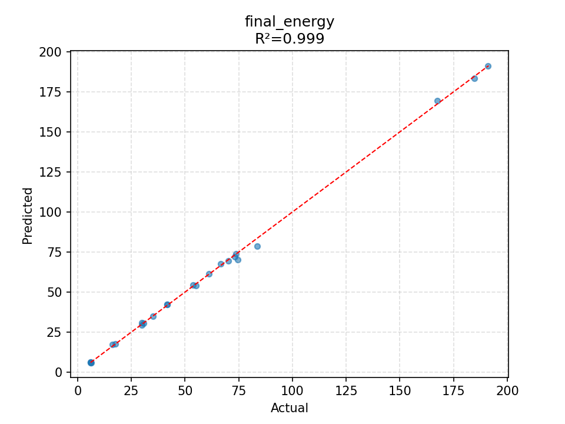
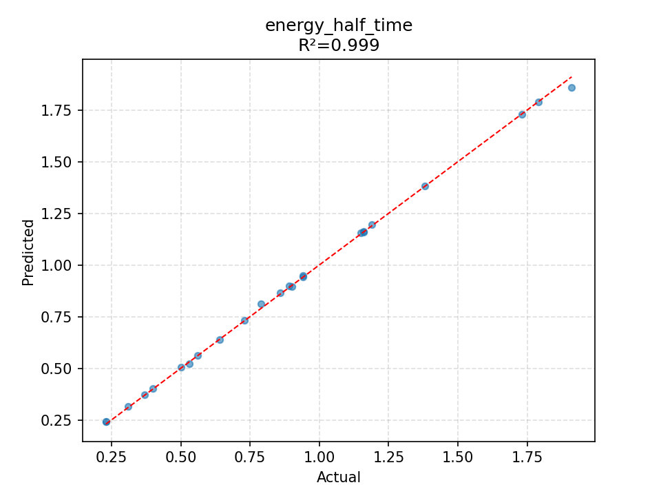
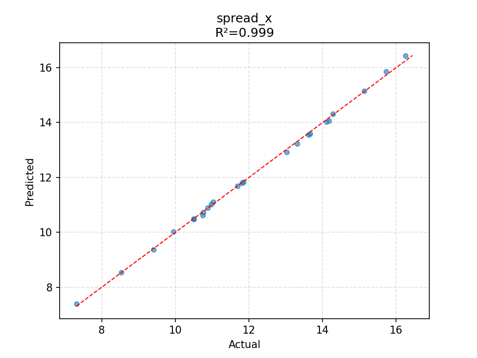
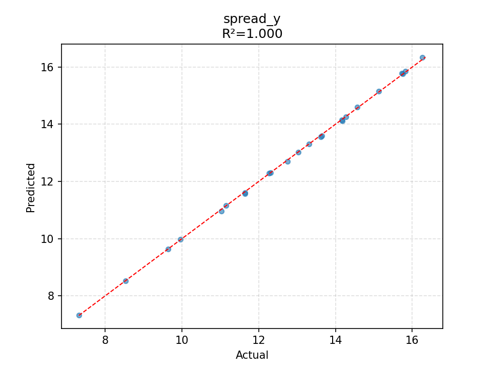

# 2D Wave Equation: CPU, MPI, GPU and Surrogate Model Performance


This project implements and benchmarks a numerical simulation of the **two-dimensional wave equation with a Gaussian initial pulse**.

The simulation models how a disturbance propagates through a 2D medium over time. A localised initial displacement represented by a Gaussian pulse is introduced into the medium. The solver then simulates how this disturbance spreads across the grid according to the wave equation, using different levels of parallelisation.

The wave equation used is

$$\frac{\partial^2 u}{\partial t^2}=c^2\left(\frac{\partial^2 u}{\partial x^2}+\frac{\partial^2 u}{\partial y^2}
\right)$$

where $u(x,y,t)$ represents the wave displacement and $c$ is the wave propagation speed.

The equation is solved numerically using a **finite-difference method** (FDM). The continuous spatial domain is represented by a grid in $\mathbb{R}^2$, and the simulation advances the solution forward one time step at a time.

At each time step, the value at each interior grid point is calculated from its neighbouring points using the standard grid based FDM method:

```text
          u(i-1,j)
              |
u(i,j-1) -- u(i,j) -- u(i,j+1)
              |
          u(i+1,j)
```

The boundaries are fixed at zero, so the wave is constrained within the computational window.

The resulting simulation produces a wave propagating outward and dissipating in time:



---

## Motivation

The simplistic nature of this toy simulation is deliberate, meaning we can focus on the parallelisation and the improvements it can bring.

For a grid containing $N_x \times N_y$ points, every time step requires updating approximately $N_xN_y$ points. A simulation with thousands of time steps therefore requires billions of individual grid-point updates.

This raises a practical computational question:

> **When does the simplicity of a conventional CPU implementation stop being worth the runtime, and when does it become worthwhile to introduce parallel computing (Probably the amount of time it takes to have a cup of tea)?**

This project investigates that question by implementing the same numerical calculation using four approaches:

* **NumPy CPU** — straightforward vectorised implementation using libraries everyone knows
* **MPI CPU** — using hundreds of CPU cores on a high performance computer via MPI communication
* **OpenCL GPU** — massively parallel implementation using a GPU
* **ML surrogate** — using a machine learning model to predict selected simulation outputs without running the full numerical simulation

The goal is not to claim that one architecture is universally faster or better, but to investigate the practical trade-off between **implementation complexity and computational performance**.

---

## Problem

The solver numerically integrates the 2D wave equation using a finite-difference method.

The computational workload increases rapidly with grid size because each time step updates every point in the 2D domain.

The implementations considered are:

* **NumPy CPU:** straightforward vectorised implementation
* **MPI CPU:** domain decomposition with halo exchange between processes
* **OpenCL GPU:** GPU implementation using a parallel 2D kernel
* **ML surrogate:** implements a machine learning model trained using data generated from the numerical simulation

---

## Implementations

### 1. NumPy CPU

The CPU implementation uses NumPy array operations to perform the finite-difference update.

This provides a simple reference implementation with relatively little code complexity.

It is intentionally not treated as a highly optimised CPU implementation. Its purpose is to represent the type of implementation that can be developed quickly for research and prototyping as is often necessary to see if your gut is on to something.

### 2. MPI CPU

The MPI implementation divides the spatial domain between processes.

Each process owns a section of the grid and exchanges boundary rows with neighbouring processes after each time step.

This introduces additional complexity through:

* domain decomposition
* ghost/halo regions
* MPI communication
* process synchronisation
* reconstruction of the global solution
* launching on a HPC using their flavour of scheduler

The benefit is that the computational workload can be distributed across multiple CPU processes, expandable up to the number your institution allows.

### 3. OpenCL GPU

The OpenCL implementation maps the finite-difference calculation onto GPU threads.

Each grid point can be updated independently from its neighbouring points, making the calculation naturally suitable for GPU parallelism.

The GPU implementation introduces additional complexity through:

* device memory management
* kernel development
* host/device transfers
* asynchronous execution and synchronisation

This approach can be made more simple if you have an Nvidia GPU with CuPy, but AMD exist.

### 4. ML Surrogate Model

A second approach to reducing the computational cost is to use a machine-learning surrogate model.

Rather than predicting the full $x,y,t$ wave, the surrogate is trained to predict **scalar summary quantities** describing the result of a simulation.

The model takes four parameters describing the initial conditions and wave propagation:

$$
X = [\sigma,\ c,\ x_0,\ y_0]
$$

where:

* $\sigma$ controls the width of the initial Gaussian pulse
* $c$ is the wave propagation speed
* $x_0$ is the initial x-position, expressed as a fraction of the domain
* $y_0$ is the initial y-position, expressed as a fraction of the domain

The model predicts six quantities extracted from the numerical simulation:

$$
Y =
[
A_{\mathrm{peak}},
t_{\mathrm{peak}},
E_{\mathrm{final}},
t_{E/2},
s_x,
s_y
]
$$

corresponding to:

* peak amplitude
* time at which the peak amplitude occurs
* final energy
* time for the energy to reach half of its initial value
* spatial spread in the x direction
* spatial spread in the y direction

#### Model

The surrogate is implemented as a **multilayer perceptron (MLP)** using PyTorch.

The network consists of fully connected layers with widths:

$$
4 \rightarrow 64 \rightarrow 128 \rightarrow 128 \rightarrow 64 \rightarrow 6
$$

with SiLU activation functions between the hidden layers.

Both the inputs and outputs are standardised using statistics calculated from the training data. This allows parameters with different physical scales to be learned within the same network.

The dataset is divided into training and validation subsets, with 80% of the generated simulations used for training and 20% reserved for validation.

The model is trained using the Adam optimiser with mean-squared error as the loss function. A cosine annealing learning-rate schedule is used during training.

---

## Benchmarking Method

The implementations were benchmarked for increasing grid sizes.

For the performance benchmark, the computational loop was timed rather than visualisation or output generation.

The primary metrics are:

### Grid points per second

$$
\text{Throughput} =
\frac{N_xN_yN_{\text{steps}}}{T}
$$

This measures the absolute computational throughput of each implementation.

### Speed up

Speed up is measured relative to the NumPy CPU implementation:

$$
S =
\frac{T_{\text{CPU}}}{T_{\text{implementation}}}
$$

A speed up of 10 therefore means that the parallel implementation completed the benchmark in approximately one tenth of the CPU baseline runtime.

---

## Results

### Grid Points per Second



The grid-points-per-second results show how computational throughput changes as the problem size increases.

The CPU implementation initially benefits from increasing workload size but eventually approaches a relatively stable throughput. This is consistent with the memory-intensive nature of the finite-difference problem.

The parallel implementations behave differently because the computational workload is distributed across multiple processing elements with the MPI method increasing significantly until it tapers off near 2200 grid points whilst still slowly increasing. We have reached a limitation of the MPI throughput.

The GPU method increases until tapering off similarly to the MPI method but appears, if the examined region was increased, the GPU method would have exceeded the MPI method significantly due to the reasonable difference near the 5000 grid size region.

---

### Speed up


The maximum measured speed ups relative to the NumPy CPU implementation were:

* **MPI CPU:** $937.28\times$
* **OpenCL GPU:** $887.53\times$

These values represent the maximum measured speed up within the tested grid-size range and should therefore be interpreted specifically relative to the NumPy baseline and hardware used for this benchmark.

The speed up results show an extreme performance improvement relative to the straightforward NumPy implementation.

For larger problems, the speed up tends to level off and can occasionally decrease slightly. This can occur even when the parallel implementation continues to process more grid points per second. This is because speed up is a **relative metric**. If both implementations become faster with increasing problem size, but the parallel implementation's throughput increases more slowly, the measured speed up can plateau or decrease.

Small fluctuations are also expected in real hardware measurements due to factors such as system load, memory contention and process scheduling.

With MPI being more variable this could be due to the nature of HPC software having nodes over multiple devices meaning communications can easily become a bottleneck in the simulation as well as saturating the cores with a significant number of grid points.

With the GPU method we have more consistent results with a continuous increase without possibly seeing the maximum the GPU can do due to the large compute capacity in the GPU and the highly parallel nature of the calculation.

---

### ML Surrogate Results

The ML surrogate was evaluated using the held-out validation data generated from the numerical simulations. The following plots compare the surrogate predictions against the corresponding quantities extracted from the numerical solver.

Rather than predicting the full wave, the model predicts a set of scalar quantities that describe important properties of the simulation.

#### Final Energy 



The final energy prediction shows how closely the surrogate reproduces the final energy calculated by the numerical simulation.

The coefficient of determination for this prediction is:

$$
R^2 = 0.99
$$

A value of $R^2$ close to 1 indicates that the surrogate is able to capture most of the variation in final energy across the validation simulations.

#### Energy Half Time



The energy half time measures the time required for the simulated energy to decrease to half of its initial value.

The surrogate predictions are compared against the values calculated from the numerical simulations. This provides a test of whether the model can reproduce the temporal behaviour of the energy dissipation without requiring the full simulation to be run.

#### X Spatial Spread



The x spatial spread describes how far the wave has spread in the x direction during the simulation.

The comparison between the predicted and numerical values shows how well the surrogate captures changes in the spatial behaviour of the wave as the input parameters are varied.

#### Y Spatial Spread



The y spatial spread provides the equivalent measure in the y direction.

Comparing this quantity against the numerical results tests whether the surrogate is able to reproduce changes in the spatial extent of the wave in both dimensions.

Together, these results demonstrate that the surrogate can approximate several physically meaningful outputs of the numerical simulation. The quality of these predictions depends on the parameter range covered by the training data and the particular quantity being predicted.

The surrogate is therefore not intended to replace the numerical solver completely. Instead, it provides an alternative when the quantities of interest can be represented by these scalar outputs and a large number of predictions are required.


---

## Interpretation

The results demonstrate an important practical trade-off.

A simple CPU implementation has a significant advantage in **development time and simplicity**. For small problems or fast testing, this can make it the most practical approach.

As the computational workload increases, however, runtime can become a constraint on research iteration.

Parallel implementations introduce additional engineering complexity, but can substantially reduce the time required for large computations.

The ML surrogate introduces a different trade-off. Instead of reducing the runtime of the numerical simulation, computational effort is moved into **generating training data and training the model**. Once trained, the model can provide predictions for selected outputs without running the full numerical simulation.

The result of this study shows the need to assess the parameters of your search to **efficiently use your time** to use the correct implementation assigning the **problem size, required runtime and number of computations being performed**.

---

## Engineering Trade-off

The benchmark can be viewed as a simple cost-benefit decision:

| Approach     | Implementation complexity | Runtime                                | Suitable use                                         |
| ------------ | ------------------------- | -------------------------------------- | ---------------------------------------------------- |
| NumPy CPU    | Low                       | Higher for large problems              | Prototyping, validation, smaller runs / simulation   |
| MPI CPU      | Medium/High               | Lower for suitable workloads           | Large CPU-based computations                         |
| OpenCL GPU   | High                      | Potentially much lower                 | Highly parallel, computationally intensive workloads |
| ML surrogate | Medium/High               | Very low inference cost after training | Large numbers of similar predictions                 |

The additional complexity of parallel computing or surrogate modelling is therefore justified when the reduction in computational time has a meaningful impact on the research workflow.

---

## Relevance to Research Computing

This benchmark reflects a decision encountered in computational research more generally.

A simple implementation can often be sufficient during the early stages of a project or even throughout the project. However, as grid sizes, parameter sweeps or numbers of simulations increase, computation time can become a limiting factor.

At that point, investing engineering effort into parallelisation can turn a computation that requires substantial waiting into one that can be run interactively.

Alternatively, when many simulations are required over a similar parameter space, a surrogate model can provide a way of avoiding repeated numerical simulations for selected outputs.

---

## Limitations

This benchmark is intended as a practical comparison rather than a comprehensive hardware benchmark.

Important limitations include:

* The NumPy implementation is a straightforward baseline rather than a fully optimised CPU implementation.
* The implementations use different parallelisation strategies.
* Hardware configuration and system load can affect measured timings.
* MPI performance depends on the number of processes and system architecture.
* GPU performance depends on the specific GPU and OpenCL implementation.
* Communication, memory bandwidth and synchronisation can become important at different problem sizes.
* The benchmark focuses on execution time and does not quantify development or maintenance time.
* The ML surrogate is limited to the parameter range represented in its training data.
* The surrogate predicts selected scalar outputs rather than the complete wave.
* Surrogate accuracy depends on the quantity being predicted and the quality and coverage of the training data.

Consequently, the measured speed ups should be interpreted specifically as **speed up relative to this particular baseline implementation and hardware configuration**.

---

## Conclusion

This project demonstrates the practical performance trade-offs involved in moving from a simple numerical implementation to parallel CPU, GPU and surrogate-model implementations.

The results show that increasing computational workload can change the engineering trade-off: a simple CPU implementation may be entirely adequate for smaller calculations, while larger workloads can justify the additional complexity of parallel computing.

The ML surrogate demonstrates a different strategy, where the cost of generating simulation data and training a model can potentially be exchanged for much cheaper inference when many similar predictions are required.

The benchmark also highlights why both **absolute throughput and relative speed up** are useful metrics when evaluating parallel implementations.

The broader lesson is that parallel computing and surrogate modelling are not simply about achieving the largest possible speed up. They are about deciding when the computational savings are large enough to justify the additional engineering complexity.

## Future Work

Possible extensions include:

* benchmarking different MPI process counts
* testing OpenCL work-group sizes
* comparing different GPU architectures
* investigating memory bandwidth
* measuring communication overhead in MPI
* comparing single and double precision
* performing repeated runs and reporting uncertainty
* separating computation, communication and memory-transfer costs
* comparing against an optimised CPU implementation
* investigating surrogate accuracy across a larger parameter space
* comparing surrogate inference time directly against numerical simulation time
* investigating uncertainty or error bounds for surrogate predictions

